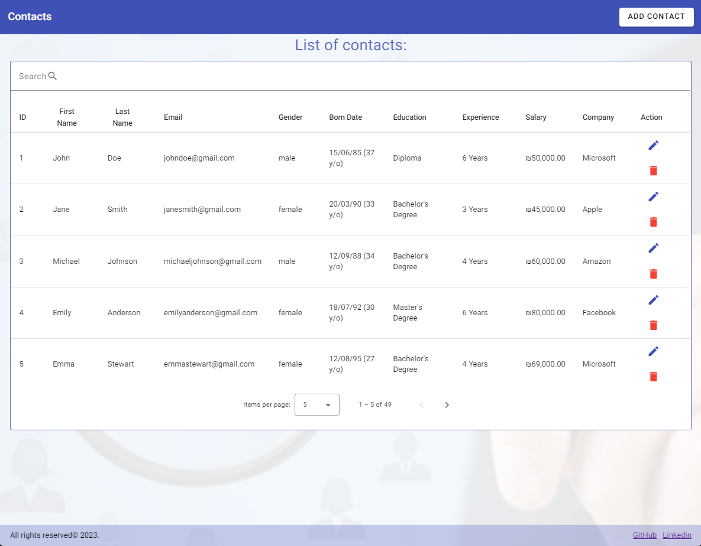
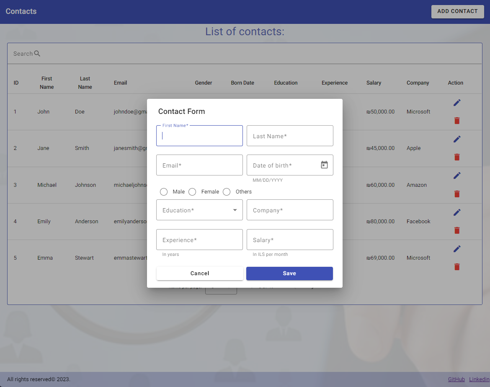
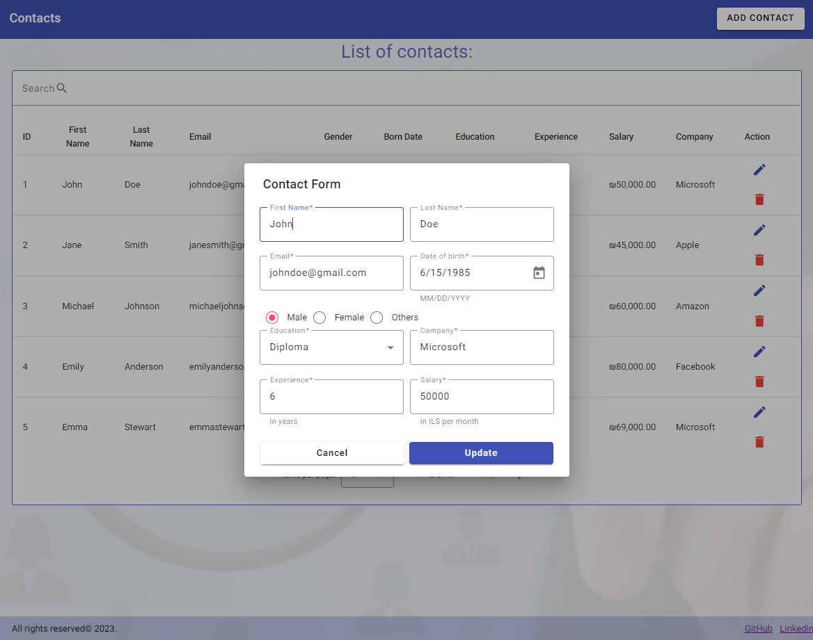
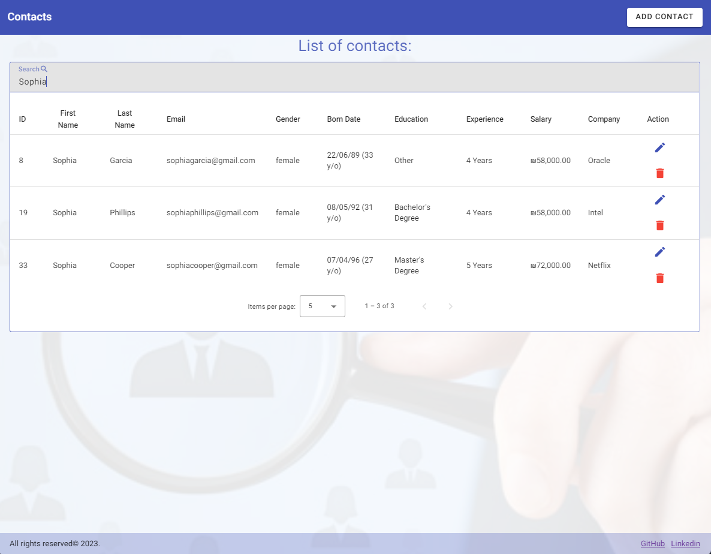
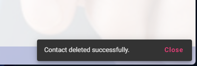
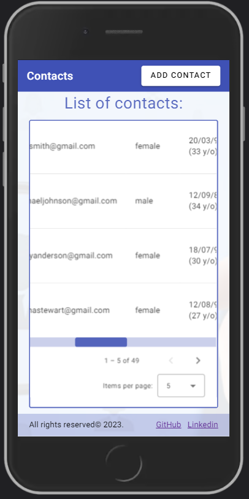
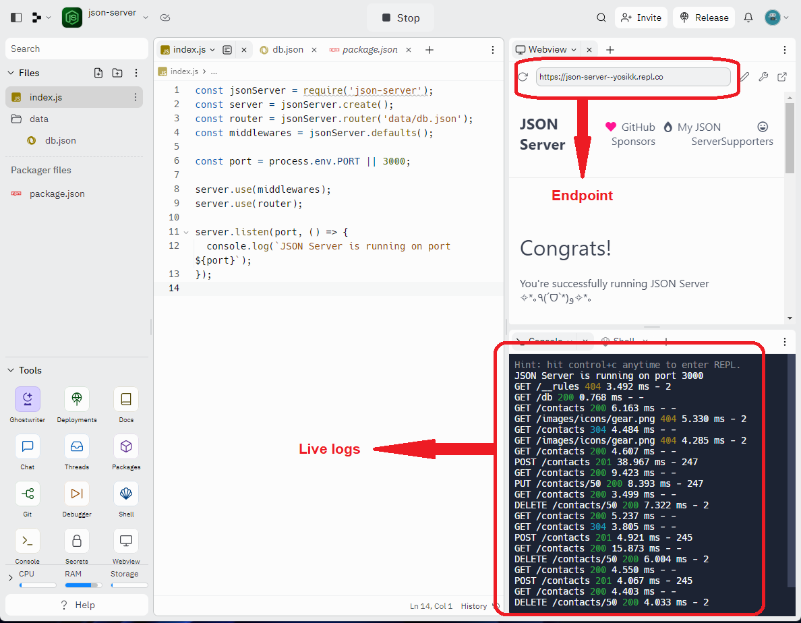

## Angular Contacts


### Introduction

This project is a simple contacts management CRUD app that is responsive and can be accessed on any device. It allows users to manage a list of contacts with information such as full name, email, gender, age, education, experience, salary, and company. The frontend application, built with Angular, is deployed on GitHub Pages and communicates with a JSON server hosted on Replit. The JSON server serves as a mock API, providing endpoints for CRUD operations on contacts. Users can view, create, update, and delete contacts through the frontend application, which interacts with the JSON server to store and retrieve contact data. The app's responsive design ensures a seamless experience across various devices.

## Table of Contents

- [Angular Contacts](#angular-contacts)
  - [Introduction](#introduction)
  - [Live Demo](#live-demo)
  - [Project Features](#project-features)
  - [Technologies Used](#technologies-used)
  - [Backend](#backend)
  - [Libraries Used](#libraries-used)
  - [Demo](#demo)
  - [Installation](#installation)
  - [Contact Me](#contact-me)
  - [Gallery](#gallery)


### Live Demo

You can access the live demo of the project [here](https://yosikari.github.io/angular-crud-deploy/).

### Project Features

- The user can add/update/delete contacts.
- Using a dynamic modal, users can add or update contacts with blank fields or pre-filled with existing contact data.
- Flash notifications are shown on every change.
- The user can search/filter contacts.
- Users can manage how many items per page will be shown and browse the available pages.

### Technologies Used

- This project was generated with [Angular CLI](https://github.com/angular/angular-cli) version 16.0.0.
- [TypeScript](https://www.typescriptlang.org/)
- [SASS](https://sass-lang.com/)

### Backend

For the backend, I used Replit hosting to run the API endpoint server. The JSON server, implemented with Node.js, serves as a mock API, providing endpoints for CRUD operations on contacts.

### Libraries Used

- [Angular Material](https://material.angular.io/)
- [json-server](https://www.npmjs.com/package/json-server)

### Demo

To see a live demo of the project, please visit [https://yosikari.github.io/angular-crud-deploy/](https://yosikari.github.io/angular-crud-deploy/).

### Installation

To run the project locally, follow these steps:

1. Clone the repository:

    ```
    git clone https://github.com/yosikari/AngularContacts.git
    ```

2. Install dependencies:

    ```
    npm install
    ```

3. Start the local JSON server:

    ```
    json-server --watch db.json
    ```

4. Start the server:

    ```
    ng serve -o
    ```

The website should now be available at [http://localhost:4200/](http://localhost:4200/).

### Contact Me

If you have any questions or feedback about the project, please feel free to reach out to me at yosikari@gmail.com.

### Gallery

#### Add Contact


#### Add Contact Modal


#### Update Contact Modal


#### Search / Filter


#### Flash notification


#### Mobile view


#### Server dashboard (Replit)


#### Json endpoint view

